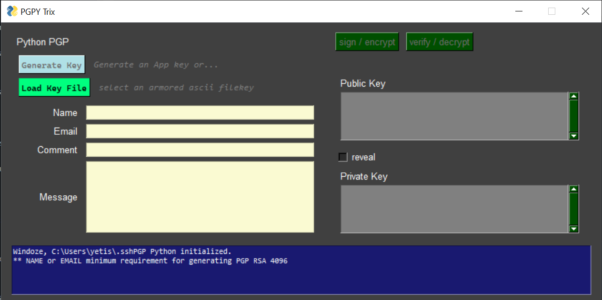

# pgpy-trix
Demo a PGP client-side GUI using [PGPy: Pretty Good Privacy for Python](https://github.com/SecurityInnovation/PGPy)

## Motivation
It's too common for interent users to rely on the security standards of the consumer applications they run. Cleartext in form fields will follow the protocols of the black-box application, leaving users vulnerble to the whims and failures of the developers. 

This tool demonstrates PGPy's capability to generate in-app client-side primary key RSA, DSA or ECDSA, or load your existing key from file. Use the key to encrypt and decrypt

## Software

Written for Python3, requires:

* hexdump==3.3
* PGPy==0.5.4
* PySimpleGUI==4.60.4

## Build status
No builds for release

 
## Screenshots

## Features

## Code Example

## Installation
Provide step by step series of examples and explanations about how to get a development env running.

## How to use?
If people like your project they’ll want to learn how they can use it. To do so include step by step guide to use your project.

## Contribute

Let people know how they can contribute into your project. A [contributing guideline](https://github.com/zulip/zulip-electron/blob/master/CONTRIBUTING.md) will be a big plus.

## Credits
Give proper credits. This could be a link to any repo which inspired you to build this project, any blogposts or links to people who contrbuted in this project. 

## License
A short snippet describing the license (MIT, Apache etc)

ZETHDUBOIS
